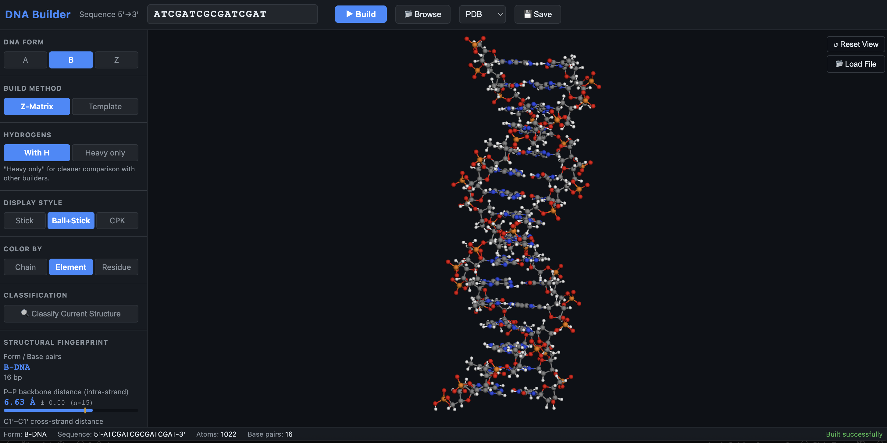
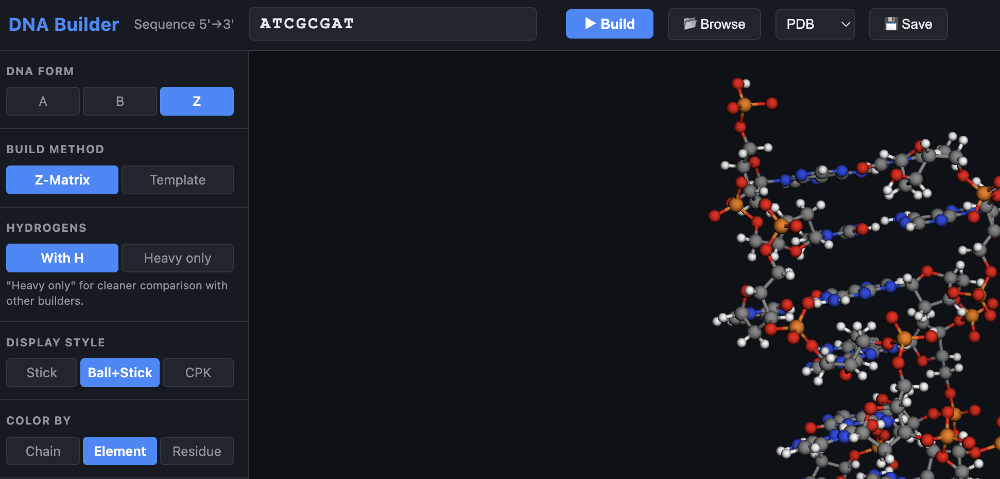
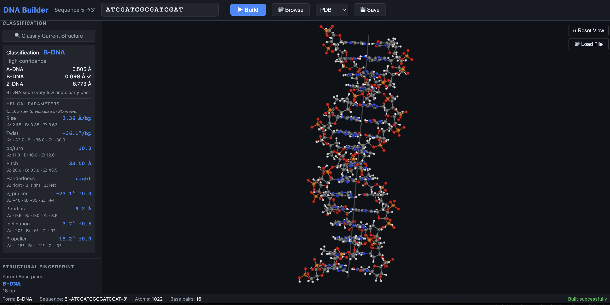
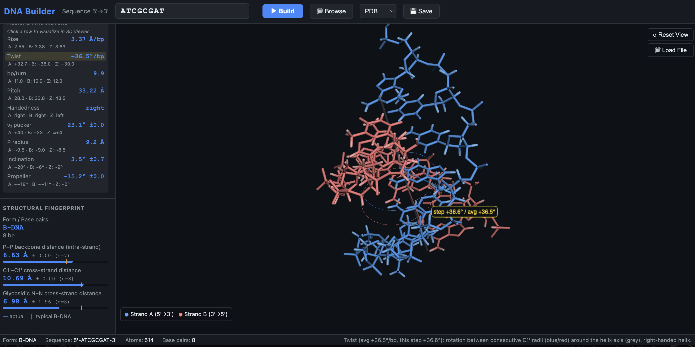

# DNA Builder

A Python tool for generating accurate A-, B-, and Z-form double-stranded DNA structures from a nucleotide sequence, and classifying the conformation of existing DNA structures. Unlike Avogadro's built-in DNA builder (which only correctly handles B-form), this tool uses validated nucleotide templates from 3DNA fiber diffraction models with correct backbone conformations for each DNA form.

## Features

- **Three DNA forms**: A-DNA, B-DNA, and Z-DNA with correct geometry
- **DNA conformation classifier**: Determine if a structure is A, B, or Z-form DNA
- **Validated against 3DNA**: RMSD < 0.01 Å for Z-DNA, < 0.15 Å for A-DNA, < 0.5 Å for B-DNA vs Colin's 3DNA reference structures
- **Validated against crystal structures**: RMSD 0.73 Å vs 1BNA (B-DNA), 1.29 Å vs 440D (A-DNA), 0.69 Å vs 1DCG (Z-DNA)
- **Correct charge model**: Each phosphate has -1 formal charge; total charge = -(2 × sequence_length)
- **Multiple formats**: PDB, XYZ, CML for output; PDB, mmCIF, XYZ for input
- **Batch-friendly**: Command-line interface for scripting

## GUI

A browser-based graphical interface is included for interactive building, visualization, and analysis.

### Launch

```bash
cd gui
pip install flask numpy
python app.py
# Open http://localhost:5052
```

### Overview

<!-- Screenshot: full GUI with a B-DNA structure loaded -->


The GUI has three main areas: a sequence/form input panel on the left, an interactive 3D viewer in the center, and a helical parameters sidebar on the right.

### Building Structures

Enter a nucleotide sequence, choose A/B/Z form, and click **Build**. The 3D structure appears immediately. Color the atoms by chain, element, or residue using the **Color By** dropdown.

<!-- Screenshot: Build panel with sequence input and form selector -->


### Conformation Classifier

Click **Classify** to run the A/B/Z classifier on the currently loaded structure. Results appear in the sidebar with RMSD scores for each form, confidence level, and key helical parameters (rise, twist, inclination, propeller twist, sugar pucker ν₂).

<!-- Screenshot: classifier output in sidebar showing B-DNA classification -->


### Helical Parameter Visualization

After classifying, click any row in the helical parameters table to draw an interactive 3D overlay showing what that parameter means geometrically — rise arrows between base pairs, twist arcs, propeller angle between the two base planes, helix axis cylinder, and so on.

<!-- Screenshot: helical parameter viz with twist arc drawn on the structure -->


### Measurements and Fingerprint

Use the **Distance** tool to click any two atoms and read off the distance. The **Fingerprint** tab displays the P–P and C1'–C1' inter-strand distance profiles, which are characteristic signatures of each DNA form.

### File I/O

Load existing structures via **Import** (PDB, mmCIF/CIF, XYZ supported, including AlphaFold3 output). Export the current structure as PDB, XYZ, or mmCIF with the **Download** button.

## Installation

Requires Python 3.7+ and NumPy.

```bash
pip install numpy
```

No additional installation needed — run directly from the project directory.

## Usage

### Building DNA Structures

```bash
# Build B-DNA (default)
python -m dna_builder ATCGATCG --output b_dna.pdb

# Build A-DNA
python -m dna_builder ATCGATCG --form A --output a_dna.pdb

# Build Z-DNA (alternating purine-pyrimidine recommended)
python -m dna_builder GCGCGCGC --form Z --output z_dna.pdb

# Output in XYZ format
python -m dna_builder ATCGATCG --format xyz --output dna.xyz

# Output in CML format (for Avogadro)
python -m dna_builder ATCGATCG --format cml --output dna.cml
```

### Classifying DNA Conformation

Determine whether a DNA structure is A-, B-, or Z-form:

```bash
# Classify an AlphaFold prediction (mmCIF format)
python -m dna_builder --classify fold_atatat_model_0.cif

# Classify a PDB file
python -m dna_builder --classify structure.pdb

# Classify an XYZ file (provide sequence hint since XYZ has no residue names)
python -m dna_builder --classify structure.xyz --sequence-hint ATATAT
```

**Example output:**
```
DNA Conformation Classifier
Input: fold_atatat_model_0.cif
Sequence: ATATAT (6 bp, chains A+B)

RMSD vs reference models (strand A):
  B-DNA: 1.54 Å (121 atoms)  ← BEST MATCH
  A-DNA: 2.86 Å (121 atoms)
  Z-DNA: 4.71 Å (121 atoms)

Classification: B-DNA
Confidence: Medium (B-DNA RMSD moderately lower than A-DNA)
```

The classifier works by:
1. Extracting the DNA sequence from the input structure
2. Building reference A, B, and Z-DNA models for that sequence
3. Computing RMSD (Kabsch superposition) against each reference
4. Classifying as the form with the lowest RMSD

**Supported input formats:**
- **PDB** — Standard ATOM records (experimental structures, molecular dynamics)
- **mmCIF** — AlphaFold3 output format (`_atom_site` loop)
- **XYZ** — Element + coordinates (requires `--sequence-hint`; classification accuracy is lower due to lack of atom names)

### Python API

```python
from dna_builder.builder import build_dna
from dna_builder.io_pdb import write_pdb, write_xyz
from dna_builder.classifier import classify_structure

# Build DNA
atoms = build_dna("ATCGATCG", form="B")
write_pdb(atoms, "b_dna.pdb")

# Classify a structure
result = classify_structure("structure.pdb")
print(f"Classification: {result['classification']}")
print(f"RMSD: {result['rmsd']}")
```

## How It Works

### Template-Based Construction

Each DNA form uses nucleotide templates extracted from validated 3DNA fiber diffraction structures:

1. **Template storage**: Complete nucleotide coordinates (base + sugar + phosphate) for each base type (A, T, G, C) on both strands, stored in the helix reference frame at position 0.

2. **Helical screw**: For each base pair at position *i*, the template coordinates are rotated by *twist × i* around the helix axis (Z) and translated by *rise × i* along Z.

3. **Strand II**: The complementary strand templates are pre-positioned correctly relative to strand I (extracted from the same reference structure), so no dyad transform is needed.

4. **Terminal phosphates**: 5' terminal O atoms (O5T) are generated to complete the PO₄ group, ensuring -1 formal charge per nucleotide.

### DNA Form Differences

| Parameter | B-DNA | A-DNA | Z-DNA |
|-----------|-------|-------|-------|
| Rise (Å) | 3.375 | 2.548 | 7.250 (per dinucleotide) |
| Twist (°) | 36.0 | 32.727 | -60.0 (per dinucleotide) |
| bp/turn | 10 | 11 | 12 |
| Handedness | Right | Right | Left |
| Sugar pucker | C2'-endo | C3'-endo | Alternating |
| Glycosidic | anti | anti | syn(pur)/anti(pyr) |
| Repeat unit | Mononucleotide | Mononucleotide | Dinucleotide |

### Z-DNA Dinucleotide Repeat

Z-DNA uses a dinucleotide as the repeat unit. Both nucleotides within a dinucleotide share the same helical screw transformation, preserving their relative geometry. Purines adopt the syn conformation with C3'-endo sugar, while pyrimidines adopt anti with C2'-endo sugar.

## Validation Results

### vs Colin's 3DNA Reference Structures

| Form | Sequences Tested | Mean RMSD | Max RMSD |
|------|-----------------|-----------|----------|
| B-DNA | 4 | 0.47 Å | 0.47 Å |
| A-DNA | 16 | 0.14 Å | 0.24 Å |
| Z-DNA | 5 | 0.005 Å | 0.009 Å |

### vs PDB Crystal Structures

| Form | PDB ID | Structure | RMSD | Atoms |
|------|--------|-----------|------|-------|
| B-DNA | 1BNA | Dickerson dodecamer (middle 6 bp) | 0.73 Å | 121 |
| A-DNA | 440D | A-DNA decamer | 1.29 Å | 404 |
| Z-DNA | 1DCG | Z-DNA hexamer (P atoms) | 0.69 Å | 5 |

### Atom Count Verification

All generated structures match Colin's 3DNA structures exactly in heavy atom composition (C, N, O, P counts).

## Project Structure

```
dna_builder/
├── __init__.py      # Package metadata
├── __main__.py      # Entry point for python -m dna_builder
├── builder.py       # Core builder: build_b_dna(), build_a_dna(), build_z_dna()
├── classifier.py    # DNA conformation classifier (A/B/Z detection)
├── cli.py           # Command-line interface (build + classify modes)
├── fiber_data.py    # Nucleotide templates and helical parameters
├── io_parser.py     # Input parsers (PDB, mmCIF, XYZ)
├── io_pdb.py        # Output writers (PDB, XYZ, CML)
└── zmatrix_builder.py  # Z-matrix based builder (default)
gui/
├── app.py           # Flask backend and API routes
└── templates/
    └── index.html   # Single-page frontend (3Dmol.js viewer)
docs/
└── screenshots/     # GUI screenshots referenced in this README
```

## References

- Arnott S, Hukins DWL (1972) Biochem Biophys Res Commun 47:1504-1509
- Arnott S, Chandrasekaran R, et al. (1980) Nature 283:743-745
- Lu XJ, Olson WK (2003) Nucleic Acids Res 31:5108-5121 (3DNA)
- Saenger W (1984) Principles of Nucleic Acid Structure, Springer

## License

MIT License
